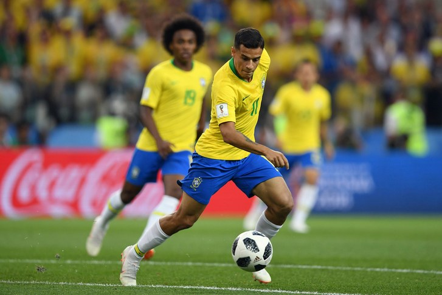
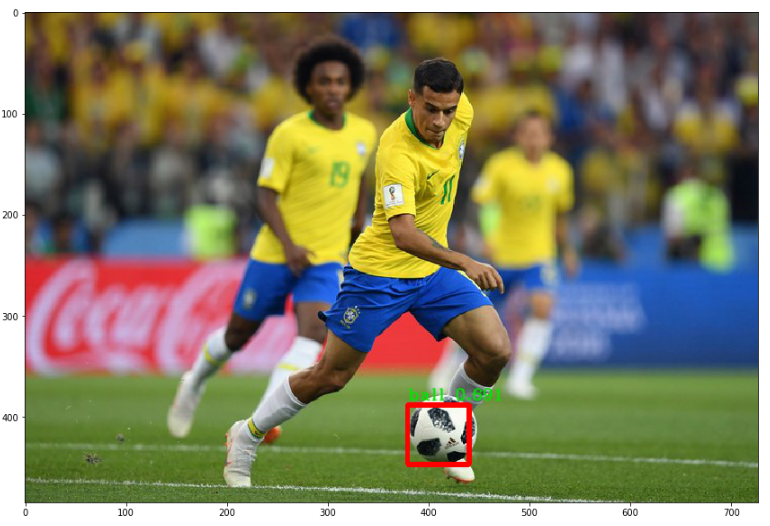

# Soccer Ball Detection using YOLOv2 (Darkflow)

## Examples

## Introduction

This notebook shows how object detection can be done on your own dataset by training state of the art model-YOLOv2. I am going to use soccer playing images as training dataset as an example to detect soccer ball. After finishing this notebook, you will be able to train your own model, and detect objects that you are interested in. 

## Before

## After

